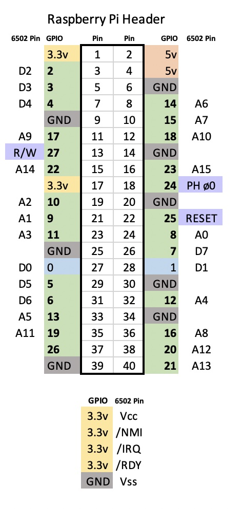

# Raspberry Pi 6502 Processor Hat

A different Apple 1 replica. The picture below shows a Rockwell 6502 processor sitting on top of Raspberry Pi Zero W2. The processor 'hat' is a prototype board and uses wirewrap to connect the 6502 CPU to the Raspberry Pi header. 

The processor is running at about 1.7 MHz (faster than the original Apple 1) and the Raspberry Pi is implementing the memory bus and system clock to implement the functions of an Apple 1. The clock speed can be slowed to match the original 1.023 Mhz of the Apple 1 if desired. 


## Is a Pi fast enough? 
I found this cool pi86 project https://github.com/homebrew8088/pi86 which implements an IBM XT system with a 8088 processor on a Pi hat. The challenge I noted with the pi86 project was that the 8088 processor was not clocking higher than about 300 KHz. Its slow, see the video below showing some game play. https://youtu.be/drXkA7xGNrc?t=237 

A part of the objective of this project was to see if the Pi can operate fast enough to run the memory bus and create a 4.7 MHz clock. To do this you have to memory map the GPIOs and a few other tricks to save time. I used a 6502 to prototype this while I wait for my Pi86 board to arrive. I'll post a video of the Apple 1 working soon. 

* Raspberry Pi Zero W2, working Apple 1 max clock **1.7 MHz**
* Raspberry Pi 4 (4GB), working Apple 1 max clock **2.6 MHz**

These results are pretty good considering the Rockwell 6502 I am using is only rated to 1 MHz. I have ordered some Western Design Centre W65C02S6TPG-14 which are rated up to 8 MHz at 3.3v. There is likely some multithreading and code level optimizations that can get us up to the 4.7 MHz level. 

## Pi6502 Schematic 

### Pin Connections


### Wiring


## Pre-requisities 

You need a Raspberry Pi. I used a Pi Zero W 2 with Raspbian installed to build this project. Run the following command to install the necessary packages. 

```
sudo apt-get install gcc make cc65 libncurses5-dev libncursesw5-dev
```
If you want to install Apple Integer Basic then download basic.rom or apple1basic.bin from the following source and place in the root folder of this project. The code expects a 4096 byte rom image called apple1basic.bin which it will load into addres E000. To run based execute `E000R` at the prompt. 

* https://github.com/jscrane/Apple1/blob/master/images/basic.rom
* http://retro.hansotten.nl/6502-sbc/apple-1/

## Building 
The build is setup to compile for a Raspberry Pi 3 or Raspberry Pi Zero W2. If you want to compile for a Raspberry Pi 4 you need to edit `line 42` of `pi6502.c` and set the Raspberry Pi model version. Its possible to write code to detect the Pi model but I wanted to keep it simple. 
```
#  define PI_VERSION 3 
```

To build its as simple as running make, the output is a executable called pi6502. 
```
make 
```

## Running 
You need to run the program as root so that it has access to the GPIOs

```
sudo ./pi6502
```

The system should startup and show a `\` prompt. 

There is no physical reset switch but you can reset the system by typing/pressing `Ctrl+A`


Try the following

```
\
E000R

E000: 4C
>10 PRINT "HELLO WORLD"
>20 GOTO 10
>RUN
```

The program will run in an infinte loop so to stop it press `Ctrl+A`


